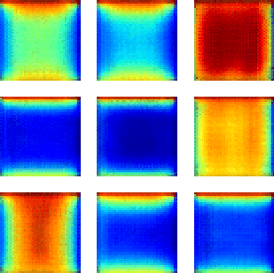

TCN model using heat transfer data 
=================================== 

TCN Intermediate images (predicted images during training)  

Organization of the project 
--------------------------- 

    ├── README.md           <- Organizational chart of this project.
    │
    ├── data
    │   ├── bdd_feu         <- Bounds of the parameters to be used.
    │   ├── raw             <- Data generated by MatLab code with uniform distribution.
    │   ├── train           <- Data of the training sample.
    │   ├── test            <- Data of the testing sample.
    │   ├── predicted       <- Data (images only) predicted by the trained model.
    │   └── intermediate    <- Data generated during training (after each 10 epochs).
    │
    ├── docs                <- Some useful materials as figures, ...
    │
    ├── models              <- Trained model (to use for prediction).
    │
    ├── notebooks           <- Jupyter notebooks.
    │
    ├── references          <- Data dictionaries, manuals, and all other explanatory materials.
    │
    ├── reports             <- Generated analysis.
    │   └── figures         <- Generated graphics and figures to be used in reporting.
    │
    ├── src                 <- Source code for use in this project. 
    │   ├── __init__.py     <- Makes src a Python module. 
    │   │
    │   ├── timer.py        <- Scripts to take into account the calculation time. 
    │   ├── heat_dist.py    <- Scripts to generate raw data using (transformed MatLab code, uniform distribution). 
    │   ├── get_data.py     <- Scripts to download or generate data. 
    │   ├── process.py      <- Scripts to process data for training models. 
    │   │
    │   ├── model.py        <- Scripts to build the architecture of the TCNN model.
    │   ├── train.py        <- Scripts to train the TCNN model.
    │   ├── predict.py      <- Scripts to generate new data (images) using trained model and test sample.
    │   └── visualize.py    <- Scripts to create exploratory and results oriented visualizations.
    │
    └── TODO...             <- TODO -------- 

-------------------------------------------- 
